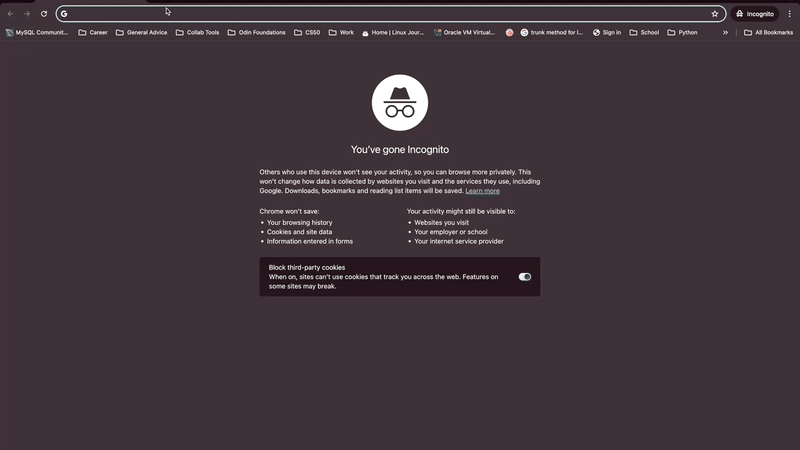

# Battleship

A simple SPA built in vanilla js that lets the user the battleship against a computer. I mainly built this app to familiarize myself with testing apps via jest.

[Live Demo](https://implexrr.github.io/battleship/)

## Preview:


---

## Key Features

- **Single-Page Application (SPA):** Dynamic component rendering without page reloads.
- **Keyboard Controls:** Players can rotate and change ship types via keyboard
- **Webpack Integration:** Optimized bundling for fast loading and performance.

## Installation

To get started, clone the repository and install dependencies:

```bash
git clone git@github.com:implexrr/battleship.git
cd battleship
npm install
```

## Running the App

### Development Mode

Launch the app in development mode:

```bash
npm run serve
```

### Production Build

To create a production-ready bundle:

```bash
npm run prod
```

## Contributing

Contributions, issues, and feature requests are welcome! Feel free to submit a pull request or open an issue.

## License

This project is licensed under the [MIT License](https://choosealicense.com/licenses/mit/).
